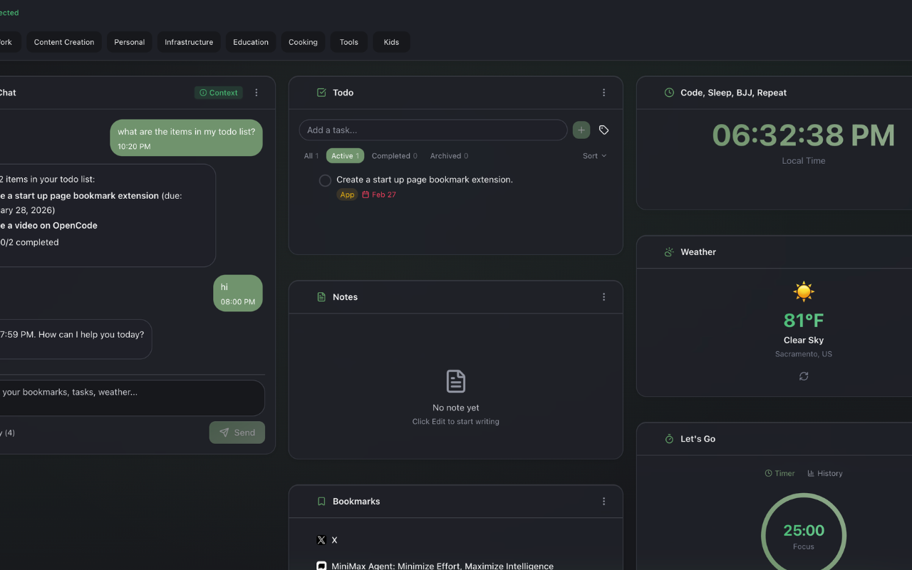
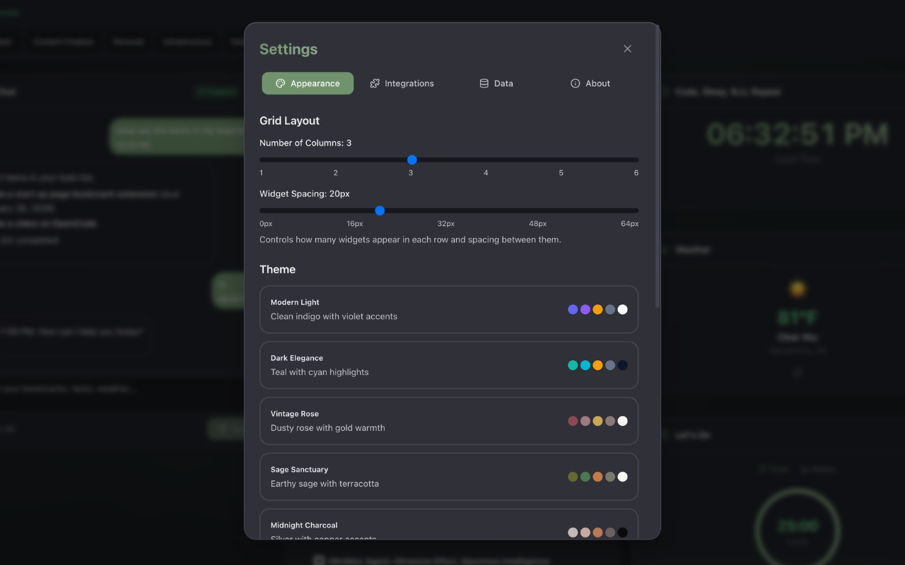
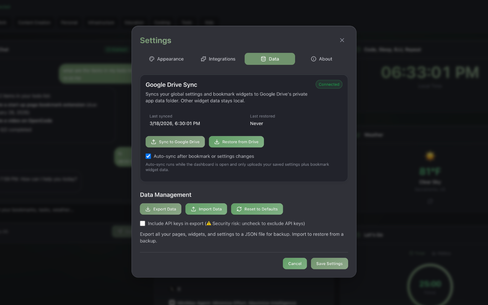
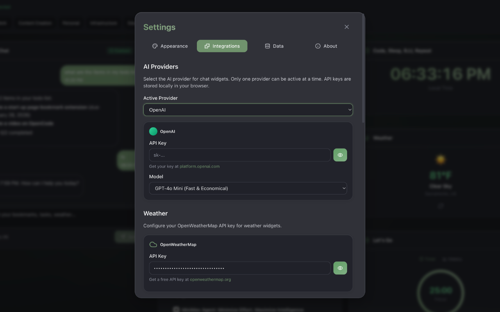
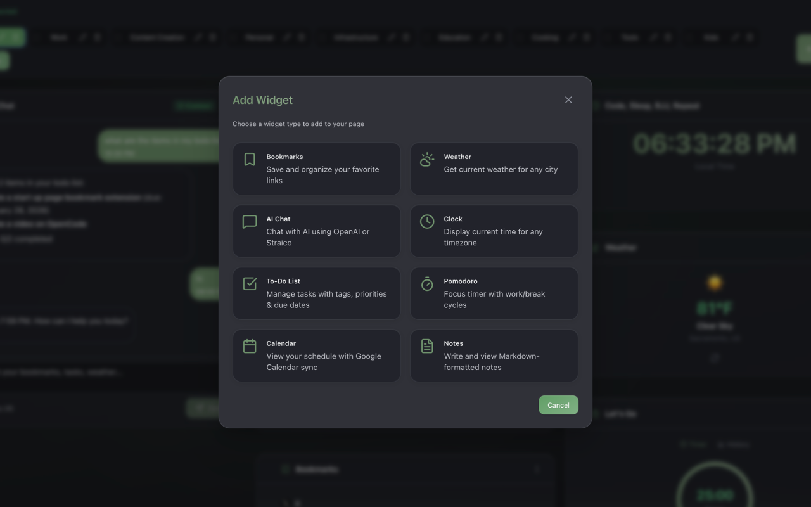

# Browser Launchpad

A modern Chrome Extension that replaces the new tab page with a customizable, widget-based dashboard.

## Features

### Multi-Page Dashboard
- Create up to 10 separate pages to organize your dashboard
- Each page can have its own unique set of widgets
- Navigate between pages using tabs in the header
- Drag and drop pages to reorder them

### Widget System

Add and customize widgets to build your perfect dashboard:

| Widget | Description |
|--------|-------------|
| **Bookmarks** | Save and organize your favorite links with custom icons |
| **Weather** | Display current weather conditions for any city worldwide |
| **AI Chat** | Chat with AI assistants using OpenAI or Straico providers |
| **Clock** | Show time for any timezone with multiple font styles (modern, classic, digital, elegant) |
| **Todo List** | Manage tasks with tags, priorities (low/medium/high), due dates, and filtering options |
| **Pomodoro** | Focus timer with customizable focus, short break, and long break durations |
| **Calendar** | Month or week view with Google Calendar integration |
| **Notes** | Simple markdown notes for quick reminders |

#### Widget Interactions
- **Drag and drop** widgets to reorder them within a page
- **Move widgets** between pages using the move dialog
- **Edit widget titles** inline by clicking the pencil icon
- **Delete widgets** with confirmation dialog

### Themes

Choose from 11 beautiful themes:

| Theme | Description |
|-------|-------------|
| **Modern Light** | Clean, bright light theme |
| **Dark Elegance** | Sophisticated dark theme |
| **Vintage Rose** | Warm, nostalgic rose tones |
| **Sage Sanctuary** | Calming green sanctuary |
| **Midnight Charcoal** | Deep charcoal dark theme |
| **Lavender Dreams** | Soft purple lavender aesthetic |
| **Caramel Comfort** | Warm caramel brown tones |
| **Arctic Frost** | Cool blue-white frost theme |
| **Crimson Night** | Bold crimson dark theme |
| **Plum Blossom** | Rich plum purple tones |
| **Sage Meadow** | Fresh green meadow colors |

### Layout Customization

- **Grid columns**: Adjust from 1 to 6 columns
- **Grid gap**: Customize spacing between widgets
- Fully responsive layout adapts to your screen size

### Data Management

- **Import/Export**: Backup and restore all your data as JSON
- **Google Drive Sync**: Automatically sync settings and bookmark widgets to your Google Drive
- **Security**: API keys are excluded from exports by default (can be included manually)

## Screenshots

### Dashboard Overview
The main dashboard with multiple widgets including AI Chat, Todo, Notes, Bookmarks, Clock, Weather, and Pomodoro timer. Navigate between pages using the tabs at the top.



### Theme & Layout Settings
Customize your dashboard appearance with grid layout options (1-6 columns, adjustable spacing) and choose from multiple themes.



### Data & Sync Settings
Sync your settings and bookmarks to Google Drive for backup, or use the import/export functionality to manage your data locally.



### API Integrations
Configure your AI providers (OpenAI, Straico) and Weather API keys to enable the AI Chat and Weather widgets.



### Widget Selection
Add widgets to your dashboard from a variety of options: Bookmarks, Weather, AI Chat, Clock, To-Do List, Pomodoro, Calendar, and Notes.



## Tech Stack

- **Frontend**: React 18 + TypeScript
- **Build Tool**: Vite
- **Styling**: Tailwind CSS
- **Platform**: Chrome Extension Manifest v3
- **Storage**: Chrome Storage API
- **DnD**: @dnd-kit for drag and drop

## Getting Started

### Prerequisites

- Node.js 18+ and npm/pnpm
- Chrome browser for development and testing

### Installation

1. Clone the repository:
   ```bash
   git clone <repository-url>
   cd browser-launchpad
   ```

2. Install dependencies:
   ```bash
   npm install
   ```

3. Start the development server:
   ```bash
   npm run dev
   ```

4. Load the extension in Chrome:
   - Open `chrome://extensions`
   - Enable "Developer mode"
   - Click "Load unpacked"
   - Select the `dist` folder

5. Open a new tab to see the extension!

## Development

### Available Scripts

| Command | Description |
|---------|-------------|
| `npm run dev` | Start development server with hot reload (port 8080) |
| `npm run build` | Production build (runs TypeScript check then Vite build) |
| `npm run lint` | Run ESLint on .ts/.tsx files |
| `npm run type` | TypeScript type check (no emit) |

### Project Structure

```
browser-launchpad/
├── src/
│   ├── components/     # React components (Modal, Header, WidgetCard, etc.)
│   ├── widgets/        # Widget implementations (BookmarkWidget, WeatherWidget, etc.)
│   ├── services/       # API and storage services (storage, googleDriveSync, googleCalendar)
│   ├── types/          # TypeScript type definitions
│   ├── utils/          # Utility functions (theme, logger, weather, calendar, etc.)
│   ├── App.tsx         # Main application component
│   ├── background.ts   # Chrome extension service worker
│   └── main.tsx        # Extension entry point
├── public/
│   ├── manifest.json   # Chrome Extension manifest
│   └── newtab.html    # New tab page HTML
├── dist/               # Build output
├── package.json
└── vite.config.ts
```

## Configuration

### API Keys

To use the AI Chat and Weather widgets, you'll need to configure API keys:

1. Open the extension
2. Click the Settings button
3. Navigate to the API Integrations tab
4. Configure your API keys:

| Service | Website | Notes |
|---------|---------|-------|
| **OpenAI** | [platform.openai.com](https://platform.openai.com) | Supports GPT-4 and GPT-3.5 models |
| **Straico** | [straico.com](https://straico.com) | Alternative AI provider |
| **OpenWeatherMap** | [openweathermap.org](https://openweathermap.org) | Free tier available |

### Google Drive Sync

To enable Google Drive backup:

1. Open Settings > Data & Sync
2. Follow the setup instructions to configure your Google Cloud project
3. Replace the placeholder OAuth client ID in `public/manifest.json`
4. Rebuild the extension: `npm run build`
5. Reload the extension in Chrome
6. Click "Connect Google Drive" to authenticate

Once connected, you can:
- **Sync to Google Drive**: Upload your settings and bookmark widgets
- **Restore from Google Drive**: Download and restore your backed-up data

### CSP Configuration

The Content Security Policy is defined in **two places** and must be kept in sync:

1. `public/manifest.json` - `content_security_policy.extension_pages`
2. `newtab.html` - `<meta http-equiv="Content-Security-Policy">`

When adding new API endpoints, update the `connect-src` directive in **both files**.

## Important Notes

- **Do not remove and re-add the extension during development** - this clears Chrome Storage and you will lose your API keys and widget configurations. Instead, use the **reload button** on the extension card in `chrome://extensions`.
- API keys are stored locally in your browser and are never sent to any server except the respective API providers.
- By default, API keys are excluded from exports for security. You can optionally include them when exporting.

## Credits

Created by **Dennis Rongo**

## License

MIT
